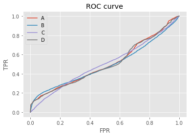

# Assignment 3

Krishan Subudhi (ksubudhi@uw.edu)

Student number: 2040900

---

Delieverables
For the training/testing data set pair you should generate

  1. 11 entropies of the successive EM iterations on each of the S seed sequence,
  1. the 4 frequency matrices,
  1. your 4 histograms of "best hit" locations and the 4 values of m,
  1. your ROC plots and AUC values, and
  1. the specific τ value requested, plus associated 4-way classification of all hits and TPR/FPR for WMM C.

Initialization pseudo_counts =  [0.0625, 0.0625, 0.0625, 0.0625]
    

# EM step

### ABC

For each of the S seed WMMs defined in "Initialization," do three E-step/M-step pairs. Among the resulting S WMMs, select three WMMs: the ones attaining the highest entropy (relative to background), the median entropy, and the lowest entropy. Call these WMMs A, B and C, respectively.

### Additional 7 rounds 
Run an additional 7 E-step/M-step pairs on all S of the third-round WMMs (a total of 10 E-M rounds on each). 

### D
Select as your final "motif" the best (highest entropy) of the S candidates after round 10; call this WMM D.

### Entropy table 
As a simple descriptive summary of this process, print in a tidy-ish S row by 11 column table the entropies of each seed WMM and its 10 successive E-M-refined iterates.

Entropy : rows = seed numbers, columns = EM iterations

<table border="1" class="dataframe">
  <thead>
    <tr style="text-align: right;">
      <th></th>
      <th>seed</th>
      <th>1</th>
      <th>2</th>
      <th>3</th>
      <th>4</th>
      <th>5</th>
      <th>6</th>
      <th>7</th>
      <th>8</th>
      <th>9</th>
      <th>10</th>
    </tr>
  </thead>
  <tbody>
    <tr>
      <th>0</th>
      <td>GGAAATGAGG</td>
      <td>4.101437</td>
      <td>3.468243</td>
      <td>3.551980</td>
      <td>3.849892</td>
      <td>4.383546</td>
      <td>5.688415</td>
      <td>8.785526</td>
      <td>11.569722</td>
      <td>12.264413</td>
      <td>12.394712</td>
    </tr>
    <tr>
      <th>1</th>
      <td>TGAGGCTGCG</td>
      <td>5.604047</td>
      <td>6.771253</td>
      <td>9.715426</td>
      <td>11.852455</td>
      <td>12.431397</td>
      <td>12.526650</td>
      <td>12.550561</td>
      <td>12.558947</td>
      <td>12.562129</td>
      <td>12.563372</td>
    </tr>
    <tr>
      <th>2</th>
      <td>CTGCGGGATC</td>
      <td>4.641795</td>
      <td>4.778124</td>
      <td>6.334913</td>
      <td>8.835332</td>
      <td>11.115841</td>
      <td>12.087170</td>
      <td>12.310047</td>
      <td>12.355397</td>
      <td>12.363863</td>
      <td>12.365415</td>
    </tr>
    <tr>
      <th>3</th>
      <td>GGATCAGCTC</td>
      <td>5.890140</td>
      <td>7.380620</td>
      <td>9.038956</td>
      <td>10.124201</td>
      <td>10.763748</td>
      <td>11.050907</td>
      <td>11.126215</td>
      <td>11.148089</td>
      <td>11.157707</td>
      <td>11.162926</td>
    </tr>
    <tr>
      <th>4</th>
      <td>AGCTCCTGAA</td>
      <td>5.332176</td>
      <td>6.757424</td>
      <td>9.842281</td>
      <td>11.713263</td>
      <td>12.357636</td>
      <td>12.498027</td>
      <td>12.538904</td>
      <td>12.553988</td>
      <td>12.560030</td>
      <td>12.562494</td>
    </tr>
    <tr>
      <th>5</th>
      <td>CTGAAAGGAT</td>
      <td>4.295636</td>
      <td>4.138803</td>
      <td>4.663001</td>
      <td>5.233681</td>
      <td>5.721469</td>
      <td>6.103128</td>
      <td>6.395686</td>
      <td>6.677838</td>
      <td>7.080728</td>
      <td>7.729858</td>
    </tr>
    <tr>
      <th>6</th>
      <td>AGGATTGCCA</td>
      <td>4.562124</td>
      <td>3.952344</td>
      <td>4.055787</td>
      <td>4.367531</td>
      <td>4.764176</td>
      <td>5.316484</td>
      <td>6.337252</td>
      <td>8.039143</td>
      <td>10.472762</td>
      <td>11.945648</td>
    </tr>
    <tr>
      <th>7</th>
      <td>TGCCAGTGAC</td>
      <td>4.992468</td>
      <td>4.432280</td>
      <td>4.476802</td>
      <td>4.652510</td>
      <td>4.852564</td>
      <td>5.050463</td>
      <td>5.247388</td>
      <td>5.454646</td>
      <td>5.679295</td>
      <td>5.919037</td>
    </tr>
    <tr>
      <th>8</th>
      <td>GTGACCTCAT</td>
      <td>4.238754</td>
      <td>3.662672</td>
      <td>3.944562</td>
      <td>4.513943</td>
      <td>5.289677</td>
      <td>6.588113</td>
      <td>8.761957</td>
      <td>10.906106</td>
      <td>12.213789</td>
      <td>12.490436</td>
    </tr>
    <tr>
      <th>9</th>
      <td>CTCATGCAGC</td>
      <td>6.379387</td>
      <td>6.706870</td>
      <td>7.356055</td>
      <td>7.992894</td>
      <td>8.911042</td>
      <td>10.537516</td>
      <td>11.638820</td>
      <td>11.928704</td>
      <td>11.990232</td>
      <td>12.008261</td>
    </tr>
    <tr>
      <th>10</th>
      <td>GCAGCTGTGA</td>
      <td>9.378287</td>
      <td>11.388313</td>
      <td>12.184184</td>
      <td>12.370138</td>
      <td>12.420888</td>
      <td>12.438405</td>
      <td>12.444815</td>
      <td>12.447087</td>
      <td>12.447833</td>
      <td>12.448041</td>
    </tr>
    <tr>
      <th>11</th>
      <td>TGTGATGTGA</td>
      <td>4.294925</td>
      <td>3.829449</td>
      <td>4.371076</td>
      <td>6.297546</td>
      <td>9.746813</td>
      <td>11.768302</td>
      <td>12.277563</td>
      <td>12.392553</td>
      <td>12.427884</td>
      <td>12.440816</td>
    </tr>
    <tr>
      <th>12</th>
      <td>TGTGAAGCTA</td>
      <td>5.325835</td>
      <td>6.476831</td>
      <td>8.322792</td>
      <td>9.684955</td>
      <td>10.547010</td>
      <td>10.988453</td>
      <td>11.118372</td>
      <td>11.149096</td>
      <td>11.159298</td>
      <td>11.164100</td>
    </tr>
    <tr>
      <th>13</th>
      <td>AGCTACAAAG</td>
      <td>4.849793</td>
      <td>5.142706</td>
      <td>6.489516</td>
      <td>8.009304</td>
      <td>9.086087</td>
      <td>9.831172</td>
      <td>10.227674</td>
      <td>10.404415</td>
      <td>10.477533</td>
      <td>10.505087</td>
    </tr>
    <tr>
      <th>14</th>
      <td>CAAAGCACTT</td>
      <td>4.720306</td>
      <td>5.395415</td>
      <td>7.564684</td>
      <td>9.298052</td>
      <td>10.800969</td>
      <td>11.943616</td>
      <td>12.433586</td>
      <td>12.519153</td>
      <td>12.542043</td>
      <td>12.554774</td>
    </tr>
    <tr>
      <th>15</th>
      <td>CACTTGTCAC</td>
      <td>6.331512</td>
      <td>9.526049</td>
      <td>11.863436</td>
      <td>12.301210</td>
      <td>12.358787</td>
      <td>12.367980</td>
      <td>12.369046</td>
      <td>12.368774</td>
      <td>12.368385</td>
      <td>12.368071</td>
    </tr>
    <tr>
      <th>16</th>
      <td>GTCACATGCC</td>
      <td>5.501955</td>
      <td>7.200354</td>
      <td>10.875283</td>
      <td>12.332635</td>
      <td>12.513016</td>
      <td>12.545576</td>
      <td>12.557266</td>
      <td>12.561666</td>
      <td>12.563266</td>
      <td>12.563848</td>
    </tr>
    <tr>
      <th>17</th>
      <td>ATGCCACAGC</td>
      <td>5.398224</td>
      <td>5.170813</td>
      <td>5.984348</td>
      <td>7.616393</td>
      <td>9.611208</td>
      <td>11.107686</td>
      <td>11.779176</td>
      <td>11.953655</td>
      <td>11.991005</td>
      <td>12.006142</td>
    </tr>
    <tr>
      <th>18</th>
      <td>ACAGCTGAGG</td>
      <td>6.408655</td>
      <td>9.928057</td>
      <td>12.121349</td>
      <td>12.388701</td>
      <td>12.428656</td>
      <td>12.440274</td>
      <td>12.444567</td>
      <td>12.446313</td>
      <td>12.447082</td>
      <td>12.447453</td>
    </tr>
    <tr>
      <th>19</th>
      <td>TGAGGTCAGA</td>
      <td>4.346094</td>
      <td>3.691003</td>
      <td>3.849952</td>
      <td>4.337526</td>
      <td>4.930715</td>
      <td>5.472428</td>
      <td>5.900337</td>
      <td>6.200604</td>
      <td>6.405835</td>
      <td>6.572016</td>
    </tr>
    <tr>
      <th>20</th>
      <td>TCAGAAGTAG</td>
      <td>5.079492</td>
      <td>5.953391</td>
      <td>8.290256</td>
      <td>10.289617</td>
      <td>11.567478</td>
      <td>12.246190</td>
      <td>12.404069</td>
      <td>12.430681</td>
      <td>12.438219</td>
      <td>12.441331</td>
    </tr>
  </tbody>
</table>

## Frequency matrices for WMMs A, B, C, and D.

### Frequency matrix for A

<table border="1" class="dataframe">
  <thead>
    <tr style="text-align: right;">
      <th></th>
      <th>1</th>
      <th>2</th>
      <th>3</th>
      <th>4</th>
      <th>5</th>
      <th>6</th>
      <th>7</th>
      <th>8</th>
      <th>9</th>
      <th>10</th>
    </tr>
  </thead>
  <tbody>
    <tr>
      <th>A</th>
      <td>0.118584</td>
      <td>0.002558</td>
      <td>0.952511</td>
      <td>0.002936</td>
      <td>0.004448</td>
      <td>0.006176</td>
      <td>0.002803</td>
      <td>0.002989</td>
      <td>0.002950</td>
      <td>0.221105</td>
    </tr>
    <tr>
      <th>C</th>
      <td>0.183453</td>
      <td>0.991722</td>
      <td>0.005976</td>
      <td>0.245307</td>
      <td>0.990142</td>
      <td>0.005422</td>
      <td>0.006039</td>
      <td>0.381009</td>
      <td>0.437490</td>
      <td>0.312607</td>
    </tr>
    <tr>
      <th>G</th>
      <td>0.566982</td>
      <td>0.002825</td>
      <td>0.002541</td>
      <td>0.748941</td>
      <td>0.002846</td>
      <td>0.002496</td>
      <td>0.988428</td>
      <td>0.020058</td>
      <td>0.139423</td>
      <td>0.225005</td>
    </tr>
    <tr>
      <th>T</th>
      <td>0.130981</td>
      <td>0.002894</td>
      <td>0.038972</td>
      <td>0.002816</td>
      <td>0.002564</td>
      <td>0.985906</td>
      <td>0.002729</td>
      <td>0.595943</td>
      <td>0.420137</td>
      <td>0.241283</td>
    </tr>
  </tbody>
</table>

### Frequency matrix for B

<table border="1" class="dataframe">
  <thead>
    <tr style="text-align: right;">
      <th></th>
      <th>1</th>
      <th>2</th>
      <th>3</th>
      <th>4</th>
      <th>5</th>
      <th>6</th>
      <th>7</th>
      <th>8</th>
      <th>9</th>
      <th>10</th>
    </tr>
  </thead>
  <tbody>
    <tr>
      <th>A</th>
      <td>0.189730</td>
      <td>0.239062</td>
      <td>0.069338</td>
      <td>0.298021</td>
      <td>0.408076</td>
      <td>0.021128</td>
      <td>0.028741</td>
      <td>0.614369</td>
      <td>0.010765</td>
      <td>0.033626</td>
    </tr>
    <tr>
      <th>C</th>
      <td>0.558870</td>
      <td>0.194539</td>
      <td>0.507797</td>
      <td>0.500854</td>
      <td>0.039201</td>
      <td>0.202788</td>
      <td>0.912328</td>
      <td>0.017890</td>
      <td>0.045067</td>
      <td>0.840690</td>
    </tr>
    <tr>
      <th>G</th>
      <td>0.100271</td>
      <td>0.085581</td>
      <td>0.319526</td>
      <td>0.095338</td>
      <td>0.211507</td>
      <td>0.724856</td>
      <td>0.018530</td>
      <td>0.005304</td>
      <td>0.922845</td>
      <td>0.062231</td>
    </tr>
    <tr>
      <th>T</th>
      <td>0.151129</td>
      <td>0.480817</td>
      <td>0.103339</td>
      <td>0.105786</td>
      <td>0.341216</td>
      <td>0.051228</td>
      <td>0.040401</td>
      <td>0.362437</td>
      <td>0.021322</td>
      <td>0.063453</td>
    </tr>
  </tbody>
</table>

### Frequency matrix for C

<table border="1" class="dataframe">
  <thead>
    <tr style="text-align: right;">
      <th></th>
      <th>1</th>
      <th>2</th>
      <th>3</th>
      <th>4</th>
      <th>5</th>
      <th>6</th>
      <th>7</th>
      <th>8</th>
      <th>9</th>
      <th>10</th>
    </tr>
  </thead>
  <tbody>
    <tr>
      <th>A</th>
      <td>0.150222</td>
      <td>0.100832</td>
      <td>0.351546</td>
      <td>0.245391</td>
      <td>0.367100</td>
      <td>0.119166</td>
      <td>0.042231</td>
      <td>0.458523</td>
      <td>0.084843</td>
      <td>0.137267</td>
    </tr>
    <tr>
      <th>C</th>
      <td>0.031810</td>
      <td>0.253620</td>
      <td>0.266641</td>
      <td>0.352051</td>
      <td>0.377278</td>
      <td>0.064859</td>
      <td>0.332720</td>
      <td>0.104604</td>
      <td>0.143019</td>
      <td>0.271611</td>
    </tr>
    <tr>
      <th>G</th>
      <td>0.655056</td>
      <td>0.587441</td>
      <td>0.291439</td>
      <td>0.304227</td>
      <td>0.191815</td>
      <td>0.292021</td>
      <td>0.606450</td>
      <td>0.117929</td>
      <td>0.632961</td>
      <td>0.431812</td>
    </tr>
    <tr>
      <th>T</th>
      <td>0.162912</td>
      <td>0.058107</td>
      <td>0.090373</td>
      <td>0.098331</td>
      <td>0.063806</td>
      <td>0.523955</td>
      <td>0.018599</td>
      <td>0.318945</td>
      <td>0.139177</td>
      <td>0.159309</td>
    </tr>
  </tbody>
</table>

### Frequency matrix for D

<table border="1" class="dataframe">
  <thead>
    <tr style="text-align: right;">
      <th></th>
      <th>1</th>
      <th>2</th>
      <th>3</th>
      <th>4</th>
      <th>5</th>
      <th>6</th>
      <th>7</th>
      <th>8</th>
      <th>9</th>
      <th>10</th>
    </tr>
  </thead>
  <tbody>
    <tr>
      <th>A</th>
      <td>0.255011</td>
      <td>0.129598</td>
      <td>0.002572</td>
      <td>0.990627</td>
      <td>0.002561</td>
      <td>0.002766</td>
      <td>0.003498</td>
      <td>0.002512</td>
      <td>0.002565</td>
      <td>0.002544</td>
    </tr>
    <tr>
      <th>C</th>
      <td>0.106450</td>
      <td>0.196177</td>
      <td>0.992282</td>
      <td>0.002637</td>
      <td>0.258775</td>
      <td>0.992099</td>
      <td>0.002480</td>
      <td>0.002622</td>
      <td>0.406971</td>
      <td>0.402154</td>
    </tr>
    <tr>
      <th>G</th>
      <td>0.272942</td>
      <td>0.529703</td>
      <td>0.002597</td>
      <td>0.002485</td>
      <td>0.736088</td>
      <td>0.002611</td>
      <td>0.002485</td>
      <td>0.992379</td>
      <td>0.014197</td>
      <td>0.125378</td>
    </tr>
    <tr>
      <th>T</th>
      <td>0.365597</td>
      <td>0.144522</td>
      <td>0.002549</td>
      <td>0.004251</td>
      <td>0.002576</td>
      <td>0.002524</td>
      <td>0.991537</td>
      <td>0.002487</td>
      <td>0.576266</td>
      <td>0.469924</td>
    </tr>
  </tbody>
</table>

# Evaluation

### Plot Scores
To use this as a "gold standard" against which to evaluate a motif, you scan each sequence with your motif WMM, scoring each of the 113-k+1 potential start positions.

    

    

    

    

    

    

    

    

## Motif predicted position histogram
1. Let c(j) be the count of the number of test sequences whose highest WMM score (leftmost highest, if ties) occurred at position j . Plot this histogram. 
 
2. Additionally, calculate and print m = arg max { c(j) | 1 ≤ j ≤ 113-k+1 }. 

### A
Most common location of the best motif hit in each sequence = 52

    

    

### B
Most common location of the best motif hit in each sequence = 50
    

    

    

### C
Most common location of the best motif hit in each sequence = 52
    

    

    

### D
Most common location of the best motif hit in each sequence = 51
    

    

    

## ROC

Generate an ROC plot for your motif, and calculate AUC. 

There are two definition of true labels in the assignment which are contradictary.

1. To do this for a test set containing n sequences, you will have n * (113 - k + 1) WMM scores, n of them labeled True, and the rest False. 

2. a motif match to a test (sub-)sequence will be declared to be a "positive" if it scores ≥ τ; furthermore, consider it to be a "true positive" if starts at position m. (51-⌊k/2⌋) ≤ m ≤ (63-⌈k/2⌉)

In this case I have assigned all poisitions between `(51-⌊k/2⌋) ≤ m ≤ (63-⌈k/2⌉)` as true label. So there can be more than n true positives in the test set.

### ROC plot

    

    

### AUC

    AUC for WMM A = 0.505
    AUC for WMM B = 0.493
    AUC for WMM C = 0.504
    AUC for WMM D = 0.501

### Largest threshold
Q: for WMM C, what is the largest τ recovering all True Positives, how many False Positives, True Negatives and False Negatives are found with the same τ and what are the corresponding TPR and FPR values?

    

    

    WMM C: Largest Threshold with TPR 1 for = -17.336

    WMM C : At threshold f -17.336 , TPR = 1.0, FPR = 1.000, tp = 13000, fp = 90988, tn = 12, fn = 0
    
