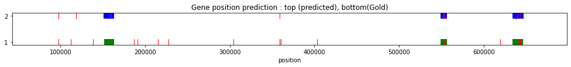

# Assignment 4

Krishan Subudhi (ksubudhi@uw.edu)

Student number: 2040900

---

Length of the DNA is 1664970

    TACATTAGTGTTTATTACATTGAGAAACTTTATAATTAAAAAAGATTCAT ..... ATAATTTACGTTGCTAATTTTATTATCCGTAGGGCATTAATAATTAGAGC

## Train

I have used pseudo_count of 0.1 to avoid zero probability and log(0) conditions in viterbi algorithm. Different values of this hyper parameter might result in slightly different results.

### Iteration 0

Emission Probability

<table border="1" class="dataframe">
<thead>
<tr style="text-align: right;">
  <th></th>
  <th>A</th>
  <th>C</th>
  <th>G</th>
  <th>T</th>
</tr>
</thead>
<tbody>
<tr>
  <th>State 1</th>
  <td>0.25</td>
  <td>0.25</td>
  <td>0.25</td>
  <td>0.25</td>
</tr>
<tr>
  <th>State 2</th>
  <td>0.20</td>
  <td>0.30</td>
  <td>0.30</td>
  <td>0.20</td>
</tr>
</tbody>
</table>

Transition Probability

<table border="1" class="dataframe">
<thead>
<tr style="text-align: right;">
  <th></th>
  <th>State 1</th>
  <th>State 2</th>
</tr>
</thead>
<tbody>
<tr>
  <th>Begin</th>
  <td>0.9999</td>
  <td>0.0001</td>
</tr>
<tr>
  <th>State 1</th>
  <td>0.9999</td>
  <td>0.0001</td>
</tr>
<tr>
  <th>State 2</th>
  <td>0.0100</td>
  <td>0.9900</td>
</tr>
</tbody>
</table>

Log probability of viterbi path=  -2308117.25052

**Hits**

<table border="1" class="dataframe">
<thead>
<tr style="text-align: right;">
  <th></th>
  <th>state</th>
  <th>start</th>
  <th>end</th>
  <th>length</th>
</tr>
</thead>
<tbody>
<tr>
  <th>1</th>
  <td>State 2</td>
  <td>154651</td>
  <td>159579</td>
  <td>4929</td>
</tr>
<tr>
  <th>2</th>
  <td>State 2</td>
  <td>638464</td>
  <td>643447</td>
  <td>4984</td>
</tr>
</tbody>
</table>

### Iteration 1

Emission Probability

<table border="1" class="dataframe">
<thead>
<tr style="text-align: right;">
  <th></th>
  <th>A</th>
  <th>C</th>
  <th>G</th>
  <th>T</th>
</tr>
</thead>
<tbody>
<tr>
  <th>State 1</th>
  <td>0.345353</td>
  <td>0.154403</td>
  <td>0.157978</td>
  <td>0.342266</td>
</tr>
<tr>
  <th>State 2</th>
  <td>0.186626</td>
  <td>0.314635</td>
  <td>0.313828</td>
  <td>0.184911</td>
</tr>
</tbody>
</table>

Transition Probability

<table border="1" class="dataframe">
<thead>
<tr style="text-align: right;">
  <th></th>
  <th>State 1</th>
  <th>State 2</th>
</tr>
</thead>
<tbody>
<tr>
  <th>Begin</th>
  <td>0.999900</td>
  <td>0.000100</td>
</tr>
<tr>
  <th>State 1</th>
  <td>0.999999</td>
  <td>0.000001</td>
</tr>
<tr>
  <th>State 2</th>
  <td>0.000212</td>
  <td>0.999788</td>
</tr>
</tbody>
</table>

Log probability of viterbi path=  -2188056.06471

**Hits**

<table border="1" class="dataframe">
<thead>
<tr style="text-align: right;">
  <th></th>
  <th>state</th>
  <th>start</th>
  <th>end</th>
  <th>length</th>
</tr>
</thead>
<tbody>
<tr>
  <th>1</th>
  <td>State 2</td>
  <td>97326</td>
  <td>97541</td>
  <td>216</td>
</tr>
<tr>
  <th>2</th>
  <td>State 2</td>
  <td>97627</td>
  <td>97823</td>
  <td>197</td>
</tr>
<tr>
  <th>3</th>
  <td>State 2</td>
  <td>111764</td>
  <td>111856</td>
  <td>93</td>
</tr>
<tr>
  <th>4</th>
  <td>State 2</td>
  <td>138345</td>
  <td>138419</td>
  <td>75</td>
</tr>
<tr>
  <th>5</th>
  <td>State 2</td>
  <td>154610</td>
  <td>159591</td>
  <td>4982</td>
</tr>
<tr>
  <th>6</th>
  <td>State 2</td>
  <td>186974</td>
  <td>187067</td>
  <td>94</td>
</tr>
<tr>
  <th>7</th>
  <td>State 2</td>
  <td>190831</td>
  <td>190907</td>
  <td>77</td>
</tr>
<tr>
  <th>8</th>
  <td>State 2</td>
  <td>215200</td>
  <td>215296</td>
  <td>97</td>
</tr>
<tr>
  <th>9</th>
  <td>State 2</td>
  <td>303990</td>
  <td>304080</td>
  <td>91</td>
</tr>
<tr>
  <th>10</th>
  <td>State 2</td>
  <td>358766</td>
  <td>358942</td>
  <td>177</td>
</tr>
</tbody>
</table>

### Iteration 2

Emission Probability

<table border="1" class="dataframe">
<thead>
<tr style="text-align: right;">
  <th></th>
  <th>A</th>
  <th>C</th>
  <th>G</th>
  <th>T</th>
</tr>
</thead>
<tbody>
<tr>
  <th>State 1</th>
  <td>0.345743</td>
  <td>0.154033</td>
  <td>0.157588</td>
  <td>0.342635</td>
</tr>
<tr>
  <th>State 2</th>
  <td>0.187626</td>
  <td>0.310809</td>
  <td>0.313583</td>
  <td>0.187982</td>
</tr>
</tbody>
</table>

Transition Probability

<table border="1" class="dataframe">
<thead>
<tr style="text-align: right;">
  <th></th>
  <th>State 1</th>
  <th>State 2</th>
</tr>
</thead>
<tbody>
<tr>
  <th>Begin</th>
  <td>0.999900</td>
  <td>0.000100</td>
</tr>
<tr>
  <th>State 1</th>
  <td>0.999986</td>
  <td>0.000014</td>
</tr>
<tr>
  <th>State 2</th>
  <td>0.001643</td>
  <td>0.998357</td>
</tr>
</tbody>
</table>

Log probability of viterbi path=  -2187965.99812

**Hits**

<table border="1" class="dataframe">
<thead>
<tr style="text-align: right;">
  <th></th>
  <th>state</th>
  <th>start</th>
  <th>end</th>
  <th>length</th>
</tr>
</thead>
<tbody>
<tr>
  <th>1</th>
  <td>State 2</td>
  <td>97326</td>
  <td>97541</td>
  <td>216</td>
</tr>
<tr>
  <th>2</th>
  <td>State 2</td>
  <td>97627</td>
  <td>97823</td>
  <td>197</td>
</tr>
<tr>
  <th>3</th>
  <td>State 2</td>
  <td>111764</td>
  <td>111856</td>
  <td>93</td>
</tr>
<tr>
  <th>4</th>
  <td>State 2</td>
  <td>118079</td>
  <td>118179</td>
  <td>101</td>
</tr>
<tr>
  <th>5</th>
  <td>State 2</td>
  <td>138345</td>
  <td>138419</td>
  <td>75</td>
</tr>
<tr>
  <th>6</th>
  <td>State 2</td>
  <td>154610</td>
  <td>157697</td>
  <td>3088</td>
</tr>
<tr>
  <th>7</th>
  <td>State 2</td>
  <td>157782</td>
  <td>159591</td>
  <td>1810</td>
</tr>
<tr>
  <th>8</th>
  <td>State 2</td>
  <td>186974</td>
  <td>187067</td>
  <td>94</td>
</tr>
<tr>
  <th>9</th>
  <td>State 2</td>
  <td>190831</td>
  <td>190907</td>
  <td>77</td>
</tr>
<tr>
  <th>10</th>
  <td>State 2</td>
  <td>215200</td>
  <td>215296</td>
  <td>97</td>
</tr>
</tbody>
</table>

### Iteration 3

Emission Probability

<table border="1" class="dataframe">
<thead>
<tr style="text-align: right;">
  <th></th>
  <th>A</th>
  <th>C</th>
  <th>G</th>
  <th>T</th>
</tr>
</thead>
<tbody>
<tr>
  <th>State 1</th>
  <td>0.345818</td>
  <td>0.153956</td>
  <td>0.157513</td>
  <td>0.342713</td>
</tr>
<tr>
  <th>State 2</th>
  <td>0.184941</td>
  <td>0.313826</td>
  <td>0.316361</td>
  <td>0.184872</td>
</tr>
</tbody>
</table>

Transition Probability

<table border="1" class="dataframe">
<thead>
<tr style="text-align: right;">
  <th></th>
  <th>State 1</th>
  <th>State 2</th>
</tr>
</thead>
<tbody>
<tr>
  <th>Begin</th>
  <td>0.999900</td>
  <td>0.000100</td>
</tr>
<tr>
  <th>State 1</th>
  <td>0.999979</td>
  <td>0.000021</td>
</tr>
<tr>
  <th>State 2</th>
  <td>0.002337</td>
  <td>0.997663</td>
</tr>
</tbody>
</table>

Log probability of viterbi path=  -2187960.60601

**Hits**

<table border="1" class="dataframe">
<thead>
<tr style="text-align: right;">
  <th></th>
  <th>state</th>
  <th>start</th>
  <th>end</th>
  <th>length</th>
</tr>
</thead>
<tbody>
<tr>
  <th>1</th>
  <td>State 2</td>
  <td>97326</td>
  <td>97541</td>
  <td>216</td>
</tr>
<tr>
  <th>2</th>
  <td>State 2</td>
  <td>97627</td>
  <td>97823</td>
  <td>197</td>
</tr>
<tr>
  <th>3</th>
  <td>State 2</td>
  <td>111764</td>
  <td>111856</td>
  <td>93</td>
</tr>
<tr>
  <th>4</th>
  <td>State 2</td>
  <td>118079</td>
  <td>118179</td>
  <td>101</td>
</tr>
<tr>
  <th>5</th>
  <td>State 2</td>
  <td>138345</td>
  <td>138419</td>
  <td>75</td>
</tr>
<tr>
  <th>6</th>
  <td>State 2</td>
  <td>154610</td>
  <td>157697</td>
  <td>3088</td>
</tr>
<tr>
  <th>7</th>
  <td>State 2</td>
  <td>157782</td>
  <td>159591</td>
  <td>1810</td>
</tr>
<tr>
  <th>8</th>
  <td>State 2</td>
  <td>186974</td>
  <td>187067</td>
  <td>94</td>
</tr>
<tr>
  <th>9</th>
  <td>State 2</td>
  <td>190831</td>
  <td>190907</td>
  <td>77</td>
</tr>
<tr>
  <th>10</th>
  <td>State 2</td>
  <td>215200</td>
  <td>215296</td>
  <td>97</td>
</tr>
</tbody>
</table>

### Iteration 4

Emission Probability

<table border="1" class="dataframe">
<thead>
<tr style="text-align: right;">
  <th></th>
  <th>A</th>
  <th>C</th>
  <th>G</th>
  <th>T</th>
</tr>
</thead>
<tbody>
<tr>
  <th>State 1</th>
  <td>0.345824</td>
  <td>0.153951</td>
  <td>0.157502</td>
  <td>0.342723</td>
</tr>
<tr>
  <th>State 2</th>
  <td>0.185215</td>
  <td>0.313457</td>
  <td>0.316727</td>
  <td>0.184601</td>
</tr>
</tbody>
</table>

Transition Probability

<table border="1" class="dataframe">
<thead>
<tr style="text-align: right;">
  <th></th>
  <th>State 1</th>
  <th>State 2</th>
</tr>
</thead>
<tbody>
<tr>
  <th>Begin</th>
  <td>0.999900</td>
  <td>0.000100</td>
</tr>
<tr>
  <th>State 1</th>
  <td>0.999979</td>
  <td>0.000021</td>
</tr>
<tr>
  <th>State 2</th>
  <td>0.002392</td>
  <td>0.997608</td>
</tr>
</tbody>
</table>

Log probability of viterbi path=  -2187960.5684

**Hits**

<table border="1" class="dataframe">
<thead>
<tr style="text-align: right;">
  <th></th>
  <th>state</th>
  <th>start</th>
  <th>end</th>
  <th>length</th>
</tr>
</thead>
<tbody>
<tr>
  <th>1</th>
  <td>State 2</td>
  <td>97326</td>
  <td>97541</td>
  <td>216</td>
</tr>
<tr>
  <th>2</th>
  <td>State 2</td>
  <td>97627</td>
  <td>97823</td>
  <td>197</td>
</tr>
<tr>
  <th>3</th>
  <td>State 2</td>
  <td>111764</td>
  <td>111856</td>
  <td>93</td>
</tr>
<tr>
  <th>4</th>
  <td>State 2</td>
  <td>118079</td>
  <td>118179</td>
  <td>101</td>
</tr>
<tr>
  <th>5</th>
  <td>State 2</td>
  <td>138345</td>
  <td>138419</td>
  <td>75</td>
</tr>
<tr>
  <th>6</th>
  <td>State 2</td>
  <td>154610</td>
  <td>157697</td>
  <td>3088</td>
</tr>
<tr>
  <th>7</th>
  <td>State 2</td>
  <td>157782</td>
  <td>159591</td>
  <td>1810</td>
</tr>
<tr>
  <th>8</th>
  <td>State 2</td>
  <td>186974</td>
  <td>187067</td>
  <td>94</td>
</tr>
<tr>
  <th>9</th>
  <td>State 2</td>
  <td>190831</td>
  <td>190907</td>
  <td>77</td>
</tr>
<tr>
  <th>10</th>
  <td>State 2</td>
  <td>215200</td>
  <td>215296</td>
  <td>97</td>
</tr>
</tbody>
</table>

### Iteration 5

Emission Probability

<table border="1" class="dataframe">
<thead>
<tr style="text-align: right;">
  <th></th>
  <th>A</th>
  <th>C</th>
  <th>G</th>
  <th>T</th>
</tr>
</thead>
<tbody>
<tr>
  <th>State 1</th>
  <td>0.345829</td>
  <td>0.153953</td>
  <td>0.15749</td>
  <td>0.342728</td>
</tr>
<tr>
  <th>State 2</th>
  <td>0.184887</td>
  <td>0.312970</td>
  <td>0.31780</td>
  <td>0.184343</td>
</tr>
</tbody>
</table>

Transition Probability

<table border="1" class="dataframe">
<thead>
<tr style="text-align: right;">
  <th></th>
  <th>State 1</th>
  <th>State 2</th>
</tr>
</thead>
<tbody>
<tr>
  <th>Begin</th>
  <td>0.999900</td>
  <td>0.000100</td>
</tr>
<tr>
  <th>State 1</th>
  <td>0.999978</td>
  <td>0.000022</td>
</tr>
<tr>
  <th>State 2</th>
  <td>0.002456</td>
  <td>0.997544</td>
</tr>
</tbody>
</table>

Log probability of viterbi path=  -2187960.50709

**Hits**

<table border="1" class="dataframe">
<thead>
<tr style="text-align: right;">
  <th></th>
  <th>state</th>
  <th>start</th>
  <th>end</th>
  <th>length</th>
</tr>
</thead>
<tbody>
<tr>
  <th>1</th>
  <td>State 2</td>
  <td>97326</td>
  <td>97541</td>
  <td>216</td>
</tr>
<tr>
  <th>2</th>
  <td>State 2</td>
  <td>97627</td>
  <td>97823</td>
  <td>197</td>
</tr>
<tr>
  <th>3</th>
  <td>State 2</td>
  <td>111764</td>
  <td>111856</td>
  <td>93</td>
</tr>
<tr>
  <th>4</th>
  <td>State 2</td>
  <td>118079</td>
  <td>118179</td>
  <td>101</td>
</tr>
<tr>
  <th>5</th>
  <td>State 2</td>
  <td>138345</td>
  <td>138419</td>
  <td>75</td>
</tr>
<tr>
  <th>6</th>
  <td>State 2</td>
  <td>154610</td>
  <td>157697</td>
  <td>3088</td>
</tr>
<tr>
  <th>7</th>
  <td>State 2</td>
  <td>157782</td>
  <td>159591</td>
  <td>1810</td>
</tr>
<tr>
  <th>8</th>
  <td>State 2</td>
  <td>186974</td>
  <td>187067</td>
  <td>94</td>
</tr>
<tr>
  <th>9</th>
  <td>State 2</td>
  <td>190831</td>
  <td>190907</td>
  <td>77</td>
</tr>
<tr>
  <th>10</th>
  <td>State 2</td>
  <td>215200</td>
  <td>215296</td>
  <td>97</td>
</tr>
</tbody>
</table>

### Iteration 6

Emission Probability

<table border="1" class="dataframe">
<thead>
<tr style="text-align: right;">
  <th></th>
  <th>A</th>
  <th>C</th>
  <th>G</th>
  <th>T</th>
</tr>
</thead>
<tbody>
<tr>
  <th>State 1</th>
  <td>0.345829</td>
  <td>0.153953</td>
  <td>0.15749</td>
  <td>0.342728</td>
</tr>
<tr>
  <th>State 2</th>
  <td>0.184887</td>
  <td>0.312970</td>
  <td>0.31780</td>
  <td>0.184343</td>
</tr>
</tbody>
</table>

Transition Probability

<table border="1" class="dataframe">
<thead>
<tr style="text-align: right;">
  <th></th>
  <th>State 1</th>
  <th>State 2</th>
</tr>
</thead>
<tbody>
<tr>
  <th>Begin</th>
  <td>0.999900</td>
  <td>0.000100</td>
</tr>
<tr>
  <th>State 1</th>
  <td>0.999978</td>
  <td>0.000022</td>
</tr>
<tr>
  <th>State 2</th>
  <td>0.002456</td>
  <td>0.997544</td>
</tr>
</tbody>
</table>

Log probability of viterbi path=  -2187960.50709

**Hits**

<table border="1" class="dataframe">
<thead>
<tr style="text-align: right;">
  <th></th>
  <th>state</th>
  <th>start</th>
  <th>end</th>
  <th>length</th>
</tr>
</thead>
<tbody>
<tr>
  <th>1</th>
  <td>State 2</td>
  <td>97326</td>
  <td>97541</td>
  <td>216</td>
</tr>
<tr>
  <th>2</th>
  <td>State 2</td>
  <td>97627</td>
  <td>97823</td>
  <td>197</td>
</tr>
<tr>
  <th>3</th>
  <td>State 2</td>
  <td>111764</td>
  <td>111856</td>
  <td>93</td>
</tr>
<tr>
  <th>4</th>
  <td>State 2</td>
  <td>118079</td>
  <td>118179</td>
  <td>101</td>
</tr>
<tr>
  <th>5</th>
  <td>State 2</td>
  <td>138345</td>
  <td>138419</td>
  <td>75</td>
</tr>
<tr>
  <th>6</th>
  <td>State 2</td>
  <td>154610</td>
  <td>157697</td>
  <td>3088</td>
</tr>
<tr>
  <th>7</th>
  <td>State 2</td>
  <td>157782</td>
  <td>159591</td>
  <td>1810</td>
</tr>
<tr>
  <th>8</th>
  <td>State 2</td>
  <td>186974</td>
  <td>187067</td>
  <td>94</td>
</tr>
<tr>
  <th>9</th>
  <td>State 2</td>
  <td>190831</td>
  <td>190907</td>
  <td>77</td>
</tr>
<tr>
  <th>10</th>
  <td>State 2</td>
  <td>215200</td>
  <td>215296</td>
  <td>97</td>
</tr>
</tbody>
</table>

### Iteration 7

Emission Probability

<table border="1" class="dataframe">
<thead>
<tr style="text-align: right;">
  <th></th>
  <th>A</th>
  <th>C</th>
  <th>G</th>
  <th>T</th>
</tr>
</thead>
<tbody>
<tr>
  <th>State 1</th>
  <td>0.345829</td>
  <td>0.153953</td>
  <td>0.15749</td>
  <td>0.342728</td>
</tr>
<tr>
  <th>State 2</th>
  <td>0.184887</td>
  <td>0.312970</td>
  <td>0.31780</td>
  <td>0.184343</td>
</tr>
</tbody>
</table>

Transition Probability

<table border="1" class="dataframe">
<thead>
<tr style="text-align: right;">
  <th></th>
  <th>State 1</th>
  <th>State 2</th>
</tr>
</thead>
<tbody>
<tr>
  <th>Begin</th>
  <td>0.999900</td>
  <td>0.000100</td>
</tr>
<tr>
  <th>State 1</th>
  <td>0.999978</td>
  <td>0.000022</td>
</tr>
<tr>
  <th>State 2</th>
  <td>0.002456</td>
  <td>0.997544</td>
</tr>
</tbody>
</table>

Log probability of viterbi path=  -2187960.50709

**Hits**

<table border="1" class="dataframe">
<thead>
<tr style="text-align: right;">
  <th></th>
  <th>state</th>
  <th>start</th>
  <th>end</th>
  <th>length</th>
</tr>
</thead>
<tbody>
<tr>
  <th>1</th>
  <td>State 2</td>
  <td>97326</td>
  <td>97541</td>
  <td>216</td>
</tr>
<tr>
  <th>2</th>
  <td>State 2</td>
  <td>97627</td>
  <td>97823</td>
  <td>197</td>
</tr>
<tr>
  <th>3</th>
  <td>State 2</td>
  <td>111764</td>
  <td>111856</td>
  <td>93</td>
</tr>
<tr>
  <th>4</th>
  <td>State 2</td>
  <td>118079</td>
  <td>118179</td>
  <td>101</td>
</tr>
<tr>
  <th>5</th>
  <td>State 2</td>
  <td>138345</td>
  <td>138419</td>
  <td>75</td>
</tr>
<tr>
  <th>6</th>
  <td>State 2</td>
  <td>154610</td>
  <td>157697</td>
  <td>3088</td>
</tr>
<tr>
  <th>7</th>
  <td>State 2</td>
  <td>157782</td>
  <td>159591</td>
  <td>1810</td>
</tr>
<tr>
  <th>8</th>
  <td>State 2</td>
  <td>186974</td>
  <td>187067</td>
  <td>94</td>
</tr>
<tr>
  <th>9</th>
  <td>State 2</td>
  <td>190831</td>
  <td>190907</td>
  <td>77</td>
</tr>
<tr>
  <th>10</th>
  <td>State 2</td>
  <td>215200</td>
  <td>215296</td>
  <td>97</td>
</tr>
</tbody>
</table>

### Iteration 8

Emission Probability

<table border="1" class="dataframe">
<thead>
<tr style="text-align: right;">
  <th></th>
  <th>A</th>
  <th>C</th>
  <th>G</th>
  <th>T</th>
</tr>
</thead>
<tbody>
<tr>
  <th>State 1</th>
  <td>0.345829</td>
  <td>0.153953</td>
  <td>0.15749</td>
  <td>0.342728</td>
</tr>
<tr>
  <th>State 2</th>
  <td>0.184887</td>
  <td>0.312970</td>
  <td>0.31780</td>
  <td>0.184343</td>
</tr>
</tbody>
</table>

Transition Probability

<table border="1" class="dataframe">
<thead>
<tr style="text-align: right;">
  <th></th>
  <th>State 1</th>
  <th>State 2</th>
</tr>
</thead>
<tbody>
<tr>
  <th>Begin</th>
  <td>0.999900</td>
  <td>0.000100</td>
</tr>
<tr>
  <th>State 1</th>
  <td>0.999978</td>
  <td>0.000022</td>
</tr>
<tr>
  <th>State 2</th>
  <td>0.002456</td>
  <td>0.997544</td>
</tr>
</tbody>
</table>

Log probability of viterbi path=  -2187960.50709

**Hits**

<table border="1" class="dataframe">
<thead>
<tr style="text-align: right;">
  <th></th>
  <th>state</th>
  <th>start</th>
  <th>end</th>
  <th>length</th>
</tr>
</thead>
<tbody>
<tr>
  <th>1</th>
  <td>State 2</td>
  <td>97326</td>
  <td>97541</td>
  <td>216</td>
</tr>
<tr>
  <th>2</th>
  <td>State 2</td>
  <td>97627</td>
  <td>97823</td>
  <td>197</td>
</tr>
<tr>
  <th>3</th>
  <td>State 2</td>
  <td>111764</td>
  <td>111856</td>
  <td>93</td>
</tr>
<tr>
  <th>4</th>
  <td>State 2</td>
  <td>118079</td>
  <td>118179</td>
  <td>101</td>
</tr>
<tr>
  <th>5</th>
  <td>State 2</td>
  <td>138345</td>
  <td>138419</td>
  <td>75</td>
</tr>
<tr>
  <th>6</th>
  <td>State 2</td>
  <td>154610</td>
  <td>157697</td>
  <td>3088</td>
</tr>
<tr>
  <th>7</th>
  <td>State 2</td>
  <td>157782</td>
  <td>159591</td>
  <td>1810</td>
</tr>
<tr>
  <th>8</th>
  <td>State 2</td>
  <td>186974</td>
  <td>187067</td>
  <td>94</td>
</tr>
<tr>
  <th>9</th>
  <td>State 2</td>
  <td>190831</td>
  <td>190907</td>
  <td>77</td>
</tr>
<tr>
  <th>10</th>
  <td>State 2</td>
  <td>215200</td>
  <td>215296</td>
  <td>97</td>
</tr>
</tbody>
</table>

### Iteration 9

Emission Probability

<table border="1" class="dataframe">
<thead>
<tr style="text-align: right;">
  <th></th>
  <th>A</th>
  <th>C</th>
  <th>G</th>
  <th>T</th>
</tr>
</thead>
<tbody>
<tr>
  <th>State 1</th>
  <td>0.345829</td>
  <td>0.153953</td>
  <td>0.15749</td>
  <td>0.342728</td>
</tr>
<tr>
  <th>State 2</th>
  <td>0.184887</td>
  <td>0.312970</td>
  <td>0.31780</td>
  <td>0.184343</td>
</tr>
</tbody>
</table>

Transition Probability

<table border="1" class="dataframe">
<thead>
<tr style="text-align: right;">
  <th></th>
  <th>State 1</th>
  <th>State 2</th>
</tr>
</thead>
<tbody>
<tr>
  <th>Begin</th>
  <td>0.999900</td>
  <td>0.000100</td>
</tr>
<tr>
  <th>State 1</th>
  <td>0.999978</td>
  <td>0.000022</td>
</tr>
<tr>
  <th>State 2</th>
  <td>0.002456</td>
  <td>0.997544</td>
</tr>
</tbody>
</table>

Log probability of viterbi path=  -2187960.50709

**Hits**

<table border="1" class="dataframe">
<thead>
<tr style="text-align: right;">
  <th></th>
  <th>state</th>
  <th>start</th>
  <th>end</th>
  <th>length</th>
</tr>
</thead>
<tbody>
<tr>
  <th>1</th>
  <td>State 2</td>
  <td>97326</td>
  <td>97541</td>
  <td>216</td>
</tr>
<tr>
  <th>2</th>
  <td>State 2</td>
  <td>97627</td>
  <td>97823</td>
  <td>197</td>
</tr>
<tr>
  <th>3</th>
  <td>State 2</td>
  <td>111764</td>
  <td>111856</td>
  <td>93</td>
</tr>
<tr>
  <th>4</th>
  <td>State 2</td>
  <td>118079</td>
  <td>118179</td>
  <td>101</td>
</tr>
<tr>
  <th>5</th>
  <td>State 2</td>
  <td>138345</td>
  <td>138419</td>
  <td>75</td>
</tr>
<tr>
  <th>6</th>
  <td>State 2</td>
  <td>154610</td>
  <td>157697</td>
  <td>3088</td>
</tr>
<tr>
  <th>7</th>
  <td>State 2</td>
  <td>157782</td>
  <td>159591</td>
  <td>1810</td>
</tr>
<tr>
  <th>8</th>
  <td>State 2</td>
  <td>186974</td>
  <td>187067</td>
  <td>94</td>
</tr>
<tr>
  <th>9</th>
  <td>State 2</td>
  <td>190831</td>
  <td>190907</td>
  <td>77</td>
</tr>
<tr>
  <th>10</th>
  <td>State 2</td>
  <td>215200</td>
  <td>215296</td>
  <td>97</td>
</tr>
</tbody>
</table>

### Iteration 10

Emission Probability

<table border="1" class="dataframe">
<thead>
<tr style="text-align: right;">
  <th></th>
  <th>A</th>
  <th>C</th>
  <th>G</th>
  <th>T</th>
</tr>
</thead>
<tbody>
<tr>
  <th>State 1</th>
  <td>0.345829</td>
  <td>0.153953</td>
  <td>0.15749</td>
  <td>0.342728</td>
</tr>
<tr>
  <th>State 2</th>
  <td>0.184887</td>
  <td>0.312970</td>
  <td>0.31780</td>
  <td>0.184343</td>
</tr>
</tbody>
</table>

Transition Probability

<table border="1" class="dataframe">
<thead>
<tr style="text-align: right;">
  <th></th>
  <th>State 1</th>
  <th>State 2</th>
</tr>
</thead>
<tbody>
<tr>
  <th>Begin</th>
  <td>0.999900</td>
  <td>0.000100</td>
</tr>
<tr>
  <th>State 1</th>
  <td>0.999978</td>
  <td>0.000022</td>
</tr>
<tr>
  <th>State 2</th>
  <td>0.002456</td>
  <td>0.997544</td>
</tr>
</tbody>
</table>

Log probability of viterbi path=  -2187960.50709

**Hits**

<table border="1" class="dataframe">
<thead>
<tr style="text-align: right;">
  <th></th>
  <th>state</th>
  <th>start</th>
  <th>end</th>
  <th>length</th>
</tr>
</thead>
<tbody>
<tr>
  <th>1</th>
  <td>State 2</td>
  <td>97326</td>
  <td>97541</td>
  <td>216</td>
</tr>
<tr>
  <th>2</th>
  <td>State 2</td>
  <td>97627</td>
  <td>97823</td>
  <td>197</td>
</tr>
<tr>
  <th>3</th>
  <td>State 2</td>
  <td>111764</td>
  <td>111856</td>
  <td>93</td>
</tr>
<tr>
  <th>4</th>
  <td>State 2</td>
  <td>118079</td>
  <td>118179</td>
  <td>101</td>
</tr>
<tr>
  <th>5</th>
  <td>State 2</td>
  <td>138345</td>
  <td>138419</td>
  <td>75</td>
</tr>
<tr>
  <th>6</th>
  <td>State 2</td>
  <td>154610</td>
  <td>157697</td>
  <td>3088</td>
</tr>
<tr>
  <th>7</th>
  <td>State 2</td>
  <td>157782</td>
  <td>159591</td>
  <td>1810</td>
</tr>
<tr>
  <th>8</th>
  <td>State 2</td>
  <td>186974</td>
  <td>187067</td>
  <td>94</td>
</tr>
<tr>
  <th>9</th>
  <td>State 2</td>
  <td>190831</td>
  <td>190907</td>
  <td>77</td>
</tr>
<tr>
  <th>10</th>
  <td>State 2</td>
  <td>215200</td>
  <td>215296</td>
  <td>97</td>
</tr>
<tr>
  <th>11</th>
  <td>State 2</td>
  <td>227705</td>
  <td>227782</td>
  <td>78</td>
</tr>
<tr>
  <th>12</th>
  <td>State 2</td>
  <td>291972</td>
  <td>291997</td>
  <td>26</td>
</tr>
<tr>
  <th>13</th>
  <td>State 2</td>
  <td>303990</td>
  <td>304080</td>
  <td>91</td>
</tr>
<tr>
  <th>14</th>
  <td>State 2</td>
  <td>358766</td>
  <td>358942</td>
  <td>177</td>
</tr>
<tr>
  <th>15</th>
  <td>State 2</td>
  <td>359974</td>
  <td>360046</td>
  <td>73</td>
</tr>
<tr>
  <th>16</th>
  <td>State 2</td>
  <td>402969</td>
  <td>403057</td>
  <td>89</td>
</tr>
<tr>
  <th>17</th>
  <td>State 2</td>
  <td>412582</td>
  <td>412635</td>
  <td>54</td>
</tr>
<tr>
  <th>18</th>
  <td>State 2</td>
  <td>552537</td>
  <td>552862</td>
  <td>326</td>
</tr>
<tr>
  <th>19</th>
  <td>State 2</td>
  <td>619161</td>
  <td>619236</td>
  <td>76</td>
</tr>
<tr>
  <th>20</th>
  <td>State 2</td>
  <td>637579</td>
  <td>638153</td>
  <td>575</td>
</tr>
<tr>
  <th>21</th>
  <td>State 2</td>
  <td>638334</td>
  <td>640132</td>
  <td>1799</td>
</tr>
<tr>
  <th>22</th>
  <td>State 2</td>
  <td>640217</td>
  <td>643449</td>
  <td>3233</td>
</tr>
<tr>
  <th>23</th>
  <td>State 2</td>
  <td>643500</td>
  <td>643767</td>
  <td>268</td>
</tr>
<tr>
  <th>24</th>
  <td>State 2</td>
  <td>763767</td>
  <td>763845</td>
  <td>79</td>
</tr>
<tr>
  <th>25</th>
  <td>State 2</td>
  <td>764022</td>
  <td>764095</td>
  <td>74</td>
</tr>
<tr>
  <th>26</th>
  <td>State 2</td>
  <td>774708</td>
  <td>774788</td>
  <td>81</td>
</tr>
<tr>
  <th>27</th>
  <td>State 2</td>
  <td>863476</td>
  <td>864151</td>
  <td>676</td>
</tr>
<tr>
  <th>28</th>
  <td>State 2</td>
  <td>873579</td>
  <td>873778</td>
  <td>200</td>
</tr>
<tr>
  <th>29</th>
  <td>State 2</td>
  <td>883675</td>
  <td>883755</td>
  <td>81</td>
</tr>
<tr>
  <th>30</th>
  <td>State 2</td>
  <td>951852</td>
  <td>951968</td>
  <td>117</td>
</tr>
<tr>
  <th>31</th>
  <td>State 2</td>
  <td>1038544</td>
  <td>1038622</td>
  <td>79</td>
</tr>
<tr>
  <th>32</th>
  <td>State 2</td>
  <td>1129124</td>
  <td>1129194</td>
  <td>71</td>
</tr>
<tr>
  <th>33</th>
  <td>State 2</td>
  <td>1150142</td>
  <td>1150402</td>
  <td>261</td>
</tr>
<tr>
  <th>34</th>
  <td>State 2</td>
  <td>1189943</td>
  <td>1190054</td>
  <td>112</td>
</tr>
<tr>
  <th>35</th>
  <td>State 2</td>
  <td>1313165</td>
  <td>1313251</td>
  <td>87</td>
</tr>
<tr>
  <th>36</th>
  <td>State 2</td>
  <td>1659451</td>
  <td>1659520</td>
  <td>70</td>
</tr>
</tbody>
</table>

Total time taken = 413.2579867839813 seconds

## Evaluate
Q: For the first 10 hits longer than 50 bp from the 10th pass, look at the genome annotation :

Since the requirement was to only analyze hits longer than 50 bp, only hits with length >100 are filtered out below.

Table 1: First 10 hits longer than 50 bp from the 10th pass:

<table border="1" class="dataframe">
  <thead>
    <tr style="text-align: right;">
      <th></th>
      <th>state</th>
      <th>start</th>
      <th>end</th>
      <th>length</th>
    </tr>
  </thead>
  <tbody>
    <tr>
      <th>0</th>
      <td>State 2</td>
      <td>97326</td>
      <td>97541</td>
      <td>216</td>
    </tr>
    <tr>
      <th>1</th>
      <td>State 2</td>
      <td>97627</td>
      <td>97823</td>
      <td>197</td>
    </tr>
    <tr>
      <th>2</th>
      <td>State 2</td>
      <td>118079</td>
      <td>118179</td>
      <td>101</td>
    </tr>
    <tr>
      <th>3</th>
      <td>State 2</td>
      <td>154610</td>
      <td>157697</td>
      <td>3088</td>
    </tr>
    <tr>
      <th>4</th>
      <td>State 2</td>
      <td>157782</td>
      <td>159591</td>
      <td>1810</td>
    </tr>
    <tr>
      <th>5</th>
      <td>State 2</td>
      <td>358766</td>
      <td>358942</td>
      <td>177</td>
    </tr>
    <tr>
      <th>6</th>
      <td>State 2</td>
      <td>552537</td>
      <td>552862</td>
      <td>326</td>
    </tr>
    <tr>
      <th>7</th>
      <td>State 2</td>
      <td>637579</td>
      <td>638153</td>
      <td>575</td>
    </tr>
    <tr>
      <th>8</th>
      <td>State 2</td>
      <td>638334</td>
      <td>640132</td>
      <td>1799</td>
    </tr>
    <tr>
      <th>9</th>
      <td>State 2</td>
      <td>640217</td>
      <td>643449</td>
      <td>3233</td>
    </tr>
  </tbody>
</table>

 
Table 2 : top 30 gold gene positions:

<table border="1" class="dataframe">
  <thead>
    <tr style="text-align: right;">
      <th></th>
      <th>start</th>
      <th>end</th>
      <th>length</th>
    </tr>
  </thead>
  <tbody>
    <tr>
      <th>0</th>
      <td>97426</td>
      <td>97537</td>
      <td>111</td>
    </tr>
    <tr>
      <th>1</th>
      <td>97629</td>
      <td>97716</td>
      <td>87</td>
    </tr>
    <tr>
      <th>2</th>
      <td>111766</td>
      <td>111854</td>
      <td>88</td>
    </tr>
    <tr>
      <th>3</th>
      <td>138344</td>
      <td>138419</td>
      <td>75</td>
    </tr>
    <tr>
      <th>4</th>
      <td>154662</td>
      <td>157639</td>
      <td>2977</td>
    </tr>
    <tr>
      <th>5</th>
      <td>157847</td>
      <td>157919</td>
      <td>72</td>
    </tr>
    <tr>
      <th>6</th>
      <td>157984</td>
      <td>159463</td>
      <td>1479</td>
    </tr>
    <tr>
      <th>7</th>
      <td>186978</td>
      <td>187066</td>
      <td>88</td>
    </tr>
    <tr>
      <th>8</th>
      <td>190832</td>
      <td>190908</td>
      <td>76</td>
    </tr>
    <tr>
      <th>9</th>
      <td>215210</td>
      <td>215297</td>
      <td>87</td>
    </tr>
    <tr>
      <th>10</th>
      <td>227704</td>
      <td>227780</td>
      <td>76</td>
    </tr>
    <tr>
      <th>11</th>
      <td>303992</td>
      <td>304081</td>
      <td>89</td>
    </tr>
    <tr>
      <th>12</th>
      <td>358768</td>
      <td>358845</td>
      <td>77</td>
    </tr>
    <tr>
      <th>13</th>
      <td>358869</td>
      <td>358943</td>
      <td>74</td>
    </tr>
    <tr>
      <th>14</th>
      <td>359972</td>
      <td>360047</td>
      <td>75</td>
    </tr>
    <tr>
      <th>15</th>
      <td>402968</td>
      <td>403044</td>
      <td>76</td>
    </tr>
    <tr>
      <th>16</th>
      <td>552541</td>
      <td>552856</td>
      <td>315</td>
    </tr>
    <tr>
      <th>17</th>
      <td>619160</td>
      <td>619234</td>
      <td>74</td>
    </tr>
    <tr>
      <th>18</th>
      <td>637583</td>
      <td>637659</td>
      <td>76</td>
    </tr>
    <tr>
      <th>19</th>
      <td>637667</td>
      <td>637742</td>
      <td>75</td>
    </tr>
    <tr>
      <th>20</th>
      <td>637772</td>
      <td>637849</td>
      <td>77</td>
    </tr>
    <tr>
      <th>21</th>
      <td>637868</td>
      <td>637942</td>
      <td>74</td>
    </tr>
    <tr>
      <th>22</th>
      <td>637982</td>
      <td>638069</td>
      <td>87</td>
    </tr>
    <tr>
      <th>23</th>
      <td>638081</td>
      <td>638152</td>
      <td>71</td>
    </tr>
    <tr>
      <th>24</th>
      <td>638448</td>
      <td>639930</td>
      <td>1482</td>
    </tr>
    <tr>
      <th>25</th>
      <td>639995</td>
      <td>640067</td>
      <td>72</td>
    </tr>
    <tr>
      <th>26</th>
      <td>640275</td>
      <td>643254</td>
      <td>2979</td>
    </tr>
    <tr>
      <th>27</th>
      <td>643333</td>
      <td>643447</td>
      <td>114</td>
    </tr>
    <tr>
      <th>28</th>
      <td>643504</td>
      <td>643761</td>
      <td>257</td>
    </tr>
    <tr>
      <th>29</th>
      <td>763766</td>
      <td>763842</td>
      <td>76</td>
    </tr>
  </tbody>
</table>

## Find match based on overlap

Considering matches with 50% overlap threshold with gold positions as positive:

Table 3: Percentage overlap - predicted gene (> 50bp) vs gold genes

<table border="1" class="dataframe">
  <thead>
    <tr style="text-align: right;">
      <th></th>
      <th>state</th>
      <th>start</th>
      <th>end</th>
      <th>length</th>
      <th>percentage_overlap</th>
      <th>overlaps</th>
      <th>match</th>
    </tr>
  </thead>
  <tbody>
    <tr>
      <th>0</th>
      <td>State 2</td>
      <td>97326</td>
      <td>97541</td>
      <td>216</td>
      <td>51.851852</td>
      <td>[[97426, 97537]]</td>
      <td>True</td>
    </tr>
    <tr>
      <th>1</th>
      <td>State 2</td>
      <td>97627</td>
      <td>97823</td>
      <td>197</td>
      <td>44.670051</td>
      <td>[[97629, 97716]]</td>
      <td>False</td>
    </tr>
    <tr>
      <th>2</th>
      <td>State 2</td>
      <td>118079</td>
      <td>118179</td>
      <td>101</td>
      <td>0.000000</td>
      <td>[]</td>
      <td>False</td>
    </tr>
    <tr>
      <th>3</th>
      <td>State 2</td>
      <td>154610</td>
      <td>157697</td>
      <td>3088</td>
      <td>96.437824</td>
      <td>[[154662, 157639]]</td>
      <td>True</td>
    </tr>
    <tr>
      <th>4</th>
      <td>State 2</td>
      <td>157782</td>
      <td>159591</td>
      <td>1810</td>
      <td>85.801105</td>
      <td>[[157847, 157919], [157984, 159463]]</td>
      <td>True</td>
    </tr>
    <tr>
      <th>5</th>
      <td>State 2</td>
      <td>358766</td>
      <td>358942</td>
      <td>177</td>
      <td>85.875706</td>
      <td>[[358768, 358845], [358869, 358943]]</td>
      <td>True</td>
    </tr>
    <tr>
      <th>6</th>
      <td>State 2</td>
      <td>552537</td>
      <td>552862</td>
      <td>326</td>
      <td>96.932515</td>
      <td>[[552541, 552856]]</td>
      <td>True</td>
    </tr>
    <tr>
      <th>7</th>
      <td>State 2</td>
      <td>637579</td>
      <td>638153</td>
      <td>575</td>
      <td>81.043478</td>
      <td>[[637583, 637659], [637667, 637742], [637772, ...</td>
      <td>True</td>
    </tr>
    <tr>
      <th>8</th>
      <td>State 2</td>
      <td>638334</td>
      <td>640132</td>
      <td>1799</td>
      <td>86.492496</td>
      <td>[[638448, 639930], [639995, 640067]]</td>
      <td>True</td>
    </tr>
    <tr>
      <th>9</th>
      <td>State 2</td>
      <td>640217</td>
      <td>643449</td>
      <td>3233</td>
      <td>95.731519</td>
      <td>[[640275, 643254], [643333, 643447]]</td>
      <td>True</td>
    </tr>
  </tbody>
</table>

### Observation
1. From the percentage overlap of  predicted genes with gold genes , it is evident that the HMM model with viterbi traning was able to predict 7/10 gene positions with more than 80% overlap. 

2. Position 118079 to 118179 (index 2 in above table)	is the only false positive and has no overlap. Genes at index 0 and 1 also have very small overlap. 

3. For prediction at index 0, the predicted position starts 50 bp before the actual gene position but ends at a position newar to the actual non-coding gene. 

4. For prediction at index 1, the prediction starts at relatively same position as the gold label but ends more than 50 bp after the actual end position. 

5. Most of the predictions struggle finding exact start and end position for that gene. For long predictions, the overlap is relatively high because of high margin of error. 

6. Some Predictions(4,5,7,8,9) tend to conflate closely-spaced RNAs by one prediction

### Plot

    

    

