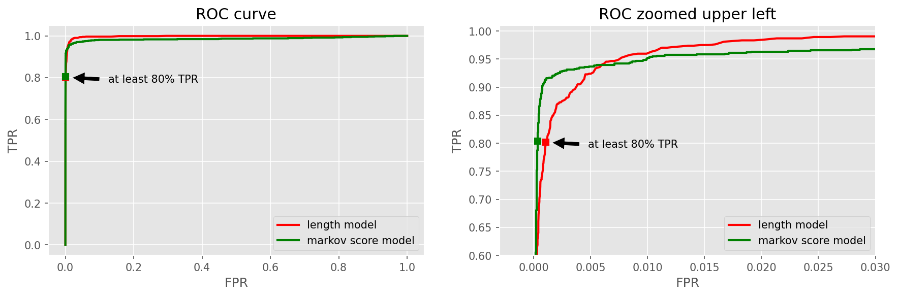
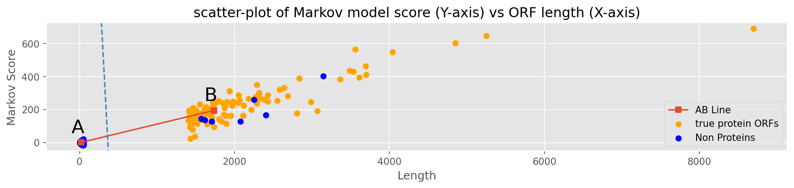
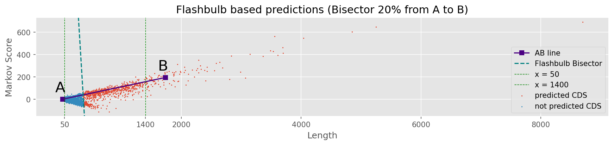
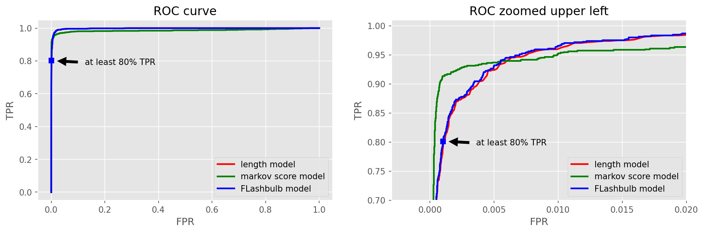
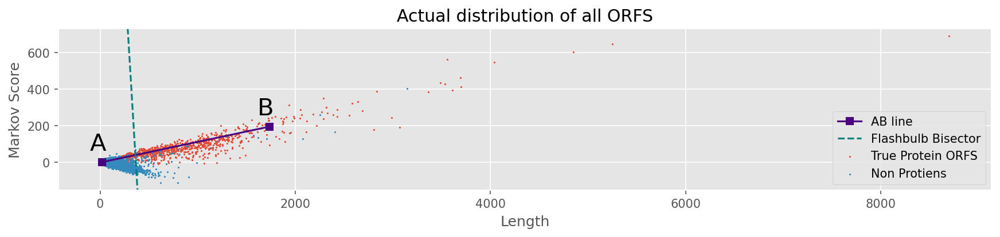

# Assignment 5
Krishan Subudhi : [ksubudhi@uw.edu](mailto:ksubudhi@uw.edu)

Student Number : 2040900

Date : 12/06/2020

---

## 1

* a) for each of the three reading frames, the number of ORFs you find, and the summary of the first and last of each
Markov model parameters:
k = 5, pseudo_count=1

    
    Reading Frame :  1
    Number of ORFs =  35200
    Summary of the first and last : 
    

<table border="1" class="dataframe">
  <thead>
    <tr style="text-align: right;">
      <th></th>
      <th>index</th>
      <th>start</th>
      <th>end</th>
      <th>length</th>
      <th>frame</th>
      <th>isCDS</th>
      <th>scores</th>
    </tr>
  </thead>
  <tbody>
    <tr>
      <th>0</th>
      <td>0</td>
      <td>1</td>
      <td>36</td>
      <td>36</td>
      <td>1</td>
      <td>False</td>
      <td>1.181405</td>
    </tr>
    <tr>
      <th>35199</th>
      <td>35199</td>
      <td>1664968</td>
      <td>1664970</td>
      <td>3</td>
      <td>1</td>
      <td>False</td>
      <td>NaN</td>
    </tr>
  </tbody>
</table>

    
    Reading Frame :  2
    Number of ORFs =  35933
    Summary of the first and last : 
    

<table border="1" class="dataframe">
  <thead>
    <tr style="text-align: right;">
      <th></th>
      <th>index</th>
      <th>start</th>
      <th>end</th>
      <th>length</th>
      <th>frame</th>
      <th>isCDS</th>
      <th>scores</th>
    </tr>
  </thead>
  <tbody>
    <tr>
      <th>0</th>
      <td>35200</td>
      <td>2</td>
      <td>94</td>
      <td>93</td>
      <td>2</td>
      <td>False</td>
      <td>2.557823</td>
    </tr>
    <tr>
      <th>35932</th>
      <td>71132</td>
      <td>1664921</td>
      <td>1664968</td>
      <td>48</td>
      <td>2</td>
      <td>False</td>
      <td>-1.381238</td>
    </tr>
  </tbody>
</table>

    
    Reading Frame :  3
    Number of ORFs =  35686
    Summary of the first and last : 
    

<table border="1" class="dataframe">
  <thead>
    <tr style="text-align: right;">
      <th></th>
      <th>index</th>
      <th>start</th>
      <th>end</th>
      <th>length</th>
      <th>frame</th>
      <th>isCDS</th>
      <th>scores</th>
    </tr>
  </thead>
  <tbody>
    <tr>
      <th>0</th>
      <td>71133</td>
      <td>3</td>
      <td>5</td>
      <td>3</td>
      <td>3</td>
      <td>False</td>
      <td>NaN</td>
    </tr>
    <tr>
      <th>35685</th>
      <td>106818</td>
      <td>1664964</td>
      <td>1664969</td>
      <td>6</td>
      <td>3</td>
      <td>False</td>
      <td>1.869675</td>
    </tr>
  </tbody>
</table>

* b) The total number of short ORFs (length less than 50)=  81738

* c) The total number of long ORFs (length greater than 1400) =  118

* d) The total number of simple plus strand CDSs found in GenBank =  848
    

* e) P(T | AAGxy) and  Q(T | AAGxy) for the 16 possible combinations of x,y in A,C,G,T :
   
    Foreground T|AAGxy counts for P(T | AAGxy) = 
        

    

    <table border="1" class="dataframe">
    <thead>
        <tr style="text-align: right;">
        <th></th>
        <th>A</th>
        <th>C</th>
        <th>G</th>
        <th>T</th>
        </tr>
    </thead>
    <tbody>
        <tr>
        <th>A</th>
        <td>307</td>
        <td>51</td>
        <td>223</td>
        <td>394</td>
        </tr>
        <tr>
        <th>C</th>
        <td>104</td>
        <td>15</td>
        <td>12</td>
        <td>119</td>
        </tr>
        <tr>
        <th>G</th>
        <td>211</td>
        <td>42</td>
        <td>39</td>
        <td>218</td>
        </tr>
        <tr>
        <th>T</th>
        <td>148</td>
        <td>19</td>
        <td>68</td>
        <td>198</td>
        </tr>
    </tbody>
    </table>
    

     
    
    Background T|AAGxy counts for Q(T | AAGxy) = 
    

    

    <table border="1" class="dataframe">
    <thead>
        <tr style="text-align: right;">
        <th></th>
        <th>A</th>
        <th>C</th>
        <th>G</th>
        <th>T</th>
        </tr>
    </thead>
    <tbody>
        <tr>
        <th>A</th>
        <td>90</td>
        <td>26</td>
        <td>48</td>
        <td>95</td>
        </tr>
        <tr>
        <th>C</th>
        <td>87</td>
        <td>22</td>
        <td>15</td>
        <td>119</td>
        </tr>
        <tr>
        <th>G</th>
        <td>41</td>
        <td>20</td>
        <td>26</td>
        <td>59</td>
        </tr>
        <tr>
        <th>T</th>
        <td>139</td>
        <td>39</td>
        <td>64</td>
        <td>175</td>
        </tr>
    </tbody>
    </table>
    

* f)Summary data for the first 5 short ORFs
    

    

    <table border="1" class="dataframe">
    <thead>
        <tr style="text-align: right;">
        <th></th>
        <th>start</th>
        <th>end</th>
        <th>length</th>
        <th>frame</th>
        <th>isCDS</th>
        <th>scores</th>
        </tr>
    </thead>
    <tbody>
        <tr>
        <th>0</th>
        <td>1</td>
        <td>36</td>
        <td>36</td>
        <td>1</td>
        <td>False</td>
        <td>1.181405</td>
        </tr>
        <tr>
        <th>71133</th>
        <td>3</td>
        <td>5</td>
        <td>3</td>
        <td>3</td>
        <td>False</td>
        <td>NaN</td>
        </tr>
        <tr>
        <th>71134</th>
        <td>9</td>
        <td>20</td>
        <td>12</td>
        <td>3</td>
        <td>False</td>
        <td>-0.463650</td>
        </tr>
        <tr>
        <th>71135</th>
        <td>24</td>
        <td>32</td>
        <td>9</td>
        <td>3</td>
        <td>False</td>
        <td>0.890789</td>
        </tr>
        <tr>
        <th>1</th>
        <td>40</td>
        <td>51</td>
        <td>12</td>
        <td>1</td>
        <td>False</td>
        <td>2.758633</td>
        </tr>
    </tbody>
    </table>
    

* f) Summary data for the the first 5 long ORFs
    

    

    <table border="1" class="dataframe">
    <thead>
        <tr style="text-align: right;">
        <th></th>
        <th>start</th>
        <th>end</th>
        <th>length</th>
        <th>frame</th>
        <th>isCDS</th>
        <th>scores</th>
        </tr>
    </thead>
    <tbody>
        <tr>
        <th>71526</th>
        <td>17619</td>
        <td>19229</td>
        <td>1611</td>
        <td>3</td>
        <td>True</td>
        <td>166.509569</td>
        </tr>
        <tr>
        <th>36031</th>
        <td>33626</td>
        <td>35245</td>
        <td>1620</td>
        <td>2</td>
        <td>True</td>
        <td>208.460996</td>
        </tr>
        <tr>
        <th>36169</th>
        <td>42725</td>
        <td>45109</td>
        <td>2385</td>
        <td>2</td>
        <td>True</td>
        <td>258.774328</td>
        </tr>
        <tr>
        <th>72661</th>
        <td>74592</td>
        <td>76010</td>
        <td>1419</td>
        <td>3</td>
        <td>True</td>
        <td>138.186040</td>
        </tr>
        <tr>
        <th>36888</th>
        <td>76820</td>
        <td>78481</td>
        <td>1662</td>
        <td>2</td>
        <td>True</td>
        <td>202.815509</td>
        </tr>
    </tbody>
    </table>
    

Extra: 
### CDSs without stop codon at the end

Some CDSs found in gff files did nto have stop codons at the end

    ORFS which are CDS = 842, Total CDSs = 848
    755683 TCG TCGTTA
    742666 CCA CCACTG
    754669 AAA AAATCA
    1563085 TTT TTTTGG
    753619 GAT GATAAA
    15774 GGT GGTTCG
    
## 2. ROC
1. Generate a single plot showing ROC curves with respect to 
    1. length threshold, say in red, and 
    2. Markov model score, say in green, 
using the full 0-1 range for both axes. 

2. Additionally, (c) generate such a plot "zoomed-in" to the upper-left corner to show the crossover between the two curves. 

3. Also calculate and show Area Under the Curve (AUC) for each curve.

    
    
    

    ### AUC

    Length threshold AUC = 0.9978549668337447 

    Markov score AUC = 0.986286204546829
    

## 3 
If your only option was to predict based on an ORF length threshold, what is the ~minimum~ maximum threshold that would achieve a true positive rate of at least 80%, how many true positives and how many false positives would you see using that threshold? Optionally, plot this point on the ROC curve above.

Prediction\Truth | Positive | Negative
:--:|--|:--:
Positive|True Poistive|False Positive
Negative|False Negative|True Negative

    TPR = TP/P = TP/(TP+FN)
    FPR = FP/N = FP/(FP+TN)

Maximum length threshold for at least 80% TPR = 432

using that threshold true positives =  675 and  false positives  = 102

Point shown on the ROC curve.

## 4
If your only option was to predict based on a log Markov model score threshold, what is the minimum maximum threshold that would achieve a true positive rate of at least 80%, how many true positives and how many false positives would you see using that threshold? Optionally, plot this point on the ROC curve above.

Maximum length threshold for at least 80% TPR = 35.6518

using that threshold true positives =  676 and  false positives  = 34

Point shown on the ROC curve.

## 5. Flashbulb Classifier
1. Generate a scatter-plot of Markov model score (Y-axis) vs ORF length (X-axis) for each long and each short ORF.

2. Color points according to their status wrt "simple plus strand CDSs" from GenBank (true protein ORFs: orange; non-proteins: blue)

3. Summarize the short ORFs by the single point that falls at the median x, median y of the ORFs of length < 50. Call this point A. Likewise, summarize the long ORFs by the single point that falls at the median x, median y of the ORFs of length > 1400; call this B. Overlay your plot with some visually distinct symbol at A and B, and connect them by a straight line segment. 

4. Q: Also draw a straight line perpendicular to this line segment and crossing it at x = Ax + 0.20 * (Bx - Ax), i.e., 20% of the way from A to B. Calculate the equation of this line.

    
    
    

5. Q: Make another scatter plot, like the one requested at the start of this step, including the A-B line segment and perpendicular line at 20% (as previously calculated, i.e., just based on the training set), but this time plot points for all ORFs, not just the training ORFs. Add thin vertical lines at x=50 and x=1400

    
    
    

6. Q: How well does this work? Find its associated True Positive and False Positive counts and rates (on the set of all ORFs, not just the short/long training set).

    A: Using points above/to ther right the threshold line as +ve and below/to the left as negative,

    true positives = 723 and false positives = 168, TPR = 0.8586698337292161, FPR = 0.0017317802288423874

7. Q: Varying that "20%" threshold from minus infinity to plus infinity, i.e., sliding a line parallel to the original 20% line across the plane, will give different tradeoffs between false positives and false negatives. Add the corresponding ROC curve to the graph from step 2 (use a different color), calculate its AUC, and for an 80% true positive rate, calculate the number of false positives (as in steps 3-4) (and optionally plot this point).

    A: I used the formula `y-mx-c` output as the flashbulb model score, then ROC curve is plotted using different thresholds for the score. For points `x,y` These scores are actully difference between the `y intercept` of a line with slope `m` passing through `x, y` vs the `y intercept` of line passing through 20% threshold point.

    Since slope is constant while calculating the intercept difference , This will be equivalent to sliding the flashbulb line explained in the assignment question. 

    This method also avoids calculating different equations for the sliding bisector and then measuring distance of every point from those interceptors.

        
    
    

    ### AUC
    Flashbulb model AUC =  0.9979613728388557
    

    For 80% TPR, true positives = 675 and false positives = 99

## How to improve the results?

The actual true CDS vs false CSD distribution is shown in the following graph. The flashbulb line which sets the threshold clearly is not the best classifier. More precisely, the slope does not seem to be accurate. 
    

    

So here are few suggestions for improvement.
1. Use a different slope. Perceptrons or gradient descent or even simple grid search on slope can be used to come up with the best slope. 
2. Use a non linear boundry. Again, neural networks can be used to create a better boundry.
3. Use annotated genes to build the markov model instead of relying on long ORFS. That way the markov scores will be more accurate.
4. Increase training data. 
5. Try with higher/lower order markov models. Tuning k can help the results. As a thumb rule, try higher k if more data available else experiment with lower k.
6. Tune pseudo count. Find number of kmers having zero probability without pseudo count. If the number is high, reduce pseudo count or reduce k.
7. Remove stop codons from -ve training data. 

